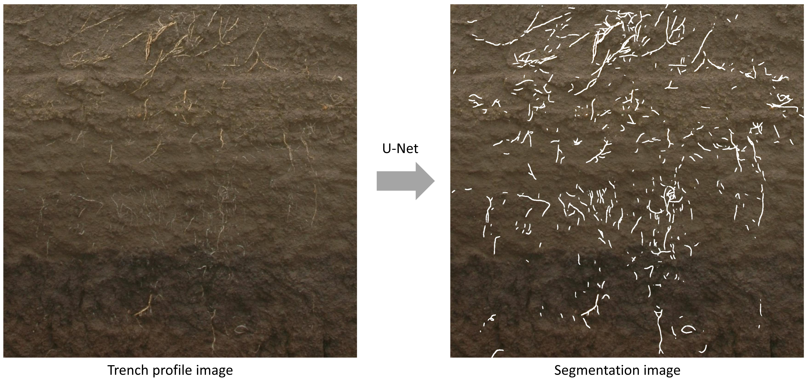
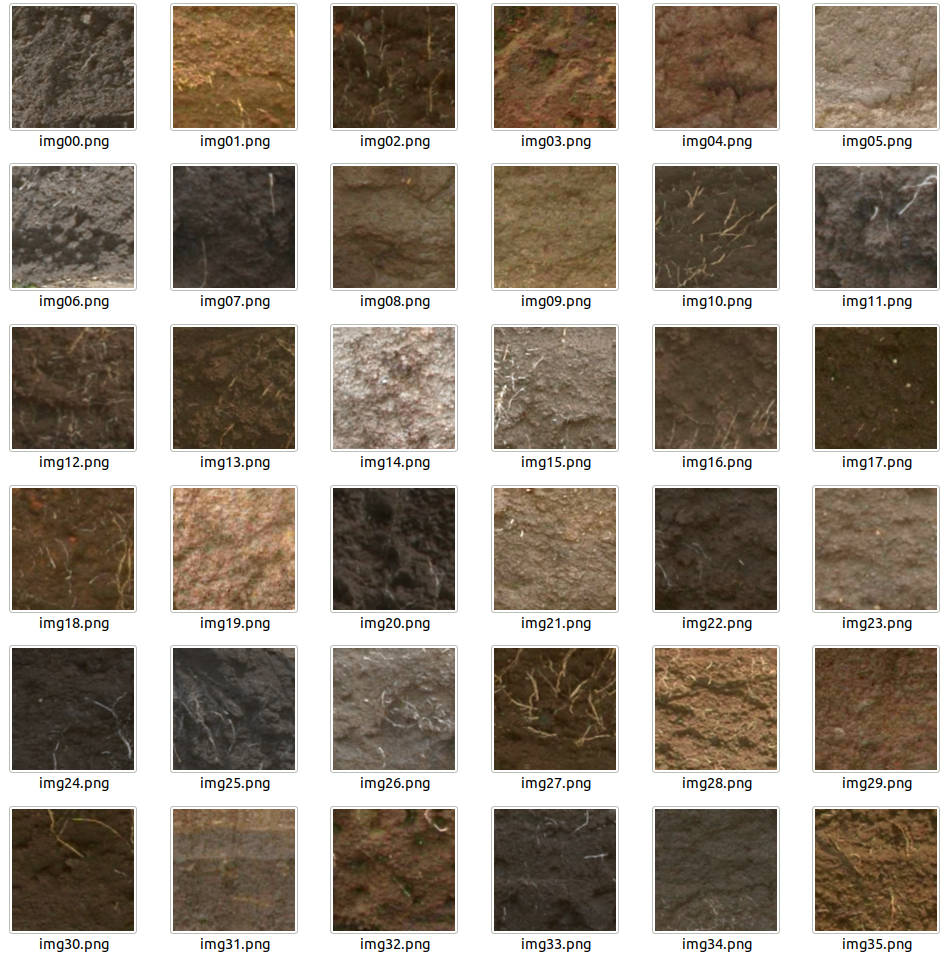

# TrenchRoot-SEG: A deep learning-based phenotypic analysis tool for trench profile images

 

TrenchRoot-SEG is the Python program for root segmentation from trench profile images. TrenchRoot-SEG uses a deep learning-based prediction model for automatic root segmentation.

## Installation

    $ git clone https://github.com/st707311g/TrenchRoot-SEG.git
    $ cd TrenchRoot-SEG

Download U-Net model:

    $ wget https://rootomics.dna.affrc.go.jp/data/TrenchRoot-SEG.hdf5

TrenchRoot-SEG was developed under Python (version 3.8.12). Check your Python version by the following command:

    $ python --version

After confirmation, install required modules:

    $ pip install --upgrade pip
    $ pip install -r requirements.txt

TrenchRoot-SEG uses TensorFlow. So, install a version of CUDA and cuDNN that corresponds to the installed TensorFlow. With the following combination of GUP, TensorFlow, CUDA, and cuDNN well worked:

- NVIDIA GeForce RTX 2080 Ti
- TensorFlow (version 2.7.0)
- CUDA (version 10.1)
- cuDNN (version 8.0.5)

The CPU can process one file in 5 to 10 seconds (Intel Core i7-8700).

## How to run

    $ python predict.py [-h] [-i INDIR] [-v]

    optional arguments:
      -h, --help            show this help message and exit
      -i INDIR, --indir INDIR
                            import a target directory
      -v, --version         show version information

Basic usage of TrenchRoot-SEG is

    $ python predict.py -i INDIR

## Demonstration

Twenty trench profile images are stored in *trench_profile_test_data* directory.

For automatic root segmentation, run the following command:

    $ python predict.py -i trench_profile_test_data

Segmented root images will be saved at the same directory where the trench profile images are located.

## Training with Images You own

If you want to train a model using images you own, store the data in `data/for_train` directory. Store RGB trench profile images in `data/for_train/root_images` and the corresponding grayscale 8-bit trace image in `data/for_train/trace_images`. The image shape and file name of a trench profile image and the corresponding trace image must be the same. There is no limit to the image shape. The image will automatically be divided into 256 x 256 size.

### Data Augmentation Test

Make sure that the image is not blown out and blocked up by the data augmentation. Run the following command.

    $ python test_data_augmentation.py

The data-augmentated images will be saved in `results/da_test` directory.

### Training

    $ python train.py [-h] [-b BATCHSIZE] [-e EPOCHS] [-w WEIGHT] [-v]

    optional arguments:
      -h, --help            show this help message and exit
      -b BATCHSIZE, --batchsize BATCHSIZE
                            batch size for training
      -e EPOCHS, --epochs EPOCHS
                            epochs for training
      -w WEIGHT, --weight WEIGHT
                            pretrained weight file [.hdf5]
      -v, --version         show version information

Basic usage of training is

    $ python train.py

With the standard settings, learning will start with a batch size of 16 epochs 500. The trained model will be saved as `results/TrenchRoot-SEG.hdf5`. If you want to use the trained model to predict root segments, move the hdf5 file to the root directory.

### Fine tuning

If you want to fine-tune a trained model, use the `-w` command to specify a pre-trained model path. Also, adjust the batch size and epochs for fine tuning. 

For example:

    $ python train.py -e 10 -w TrenchRoot-SEG.hdf5

## Citation

Please cite the following article:

Shota Teramoto et al. (2020) [A deep learning-based phenotypic analysis of rice root distribution from field images](https://doi.org/10.34133/2020/3194308) Plant Phenomics. Volume 2020, Article ID 3194308

## Copyright

National Agriculture and Food Research Organization (2020)

## Project homepage
https://rootomics.dna.affrc.go.jp/en/

## update history

* version 1.0 (Dec 11, 2020)
  * initial version uploaded
  * manual updated
* version 1.1 (Dec 7, 2021)
  * learning code added
  * license notation corrected
* version 1.2 (Dec 13, 2021)
  * operating environment updated