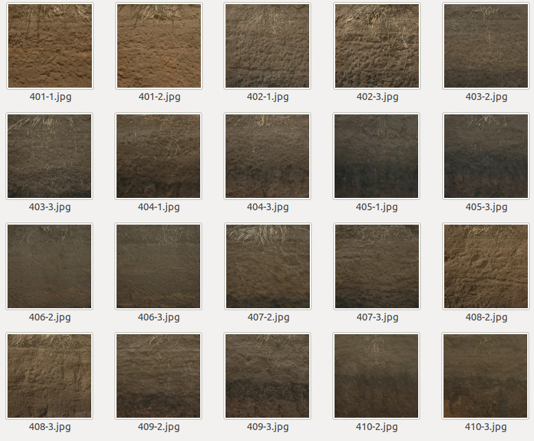
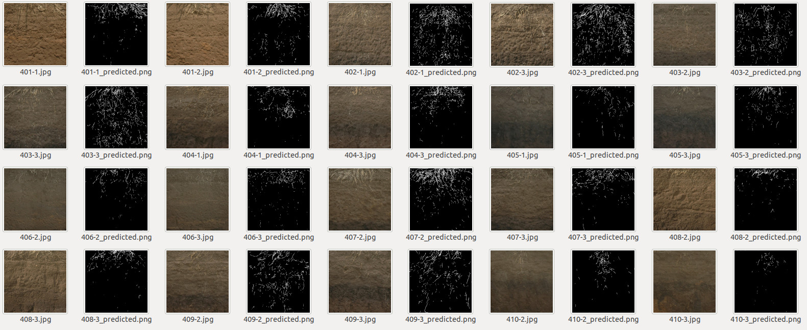

# TrenchRoot-SEG: A deep learning-based phenotypic analysis tool for trench profile images

TrenchRoot-SEG is the Python program for root segmentation from trench profile images. TrenchRoot-SEG uses a deep learning-based prediction model for automatic root segmentation

## Copyright

National Agriculture and Food Research Organization (2020)

## Installation

    $ git clone https://github.com/st707311g/TrenchRoot-SEG.git
    $ cd TrenchRoot-SEG

Download U-Net model:

    $ wget https://rootomics.dna.affrc.go.jp/data/TrenchRoot-SEG.hdf5

TrenchRoot-SEG was developed under Python (version 3.8.2). Check your Python version by the following command:

    $ python --version

After confirmation, install required modules:

    $ pip install --upgrade pip
    $ pip install -r requirements.txt

TrenchRoot-SEG uses TensorFlow. So, install a version of CUDA and cuDNN that corresponds to the installed TensorFlow. With the following combination of GUP, TensorFlow, CUDA, and cuDNN well worked:

- NVIDIA GeForce RTX 2080 Ti
- TensorFlow (version 2.4.0)
- CUDA (version 10.1)
- cuDNN (version 8.0.5)

The CPU can process one file in 5 to 10 seconds (Intel Core i7-8700).

## How to run

    $ python predict.py [-h] [-i INDIR] [-v]

    optional arguments:
      -h, --help            show this help message and exit
      -i INDIR, --indir INDIR
                            import a target directory
      -v, --version         show version information

Basic usage of RSAvis3D is

    $ python predict.py -i INDIR

## Demonstration

Twenty trench profile images are stored in *images* directory.

For automatic root segmentation, run the following command:

    $ python predict.py -i trench_profile_test_data

Segmented root images will be saved at the same directory where the trench profile images are located.

## Citation

If you use this code or modified ones, please cite our work: Shota Teramoto et al. (2020) [A deep learning-based phenotypic analysis of rice root distribution from field images](https://doi.org/10.34133/2020/3194308) 

## Project homepage
https://rootomics.dna.affrc.go.jp/en/